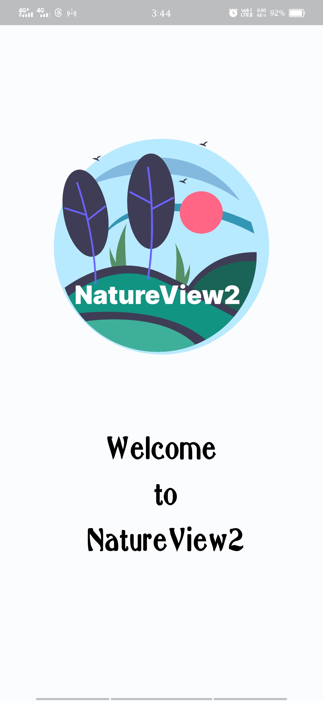
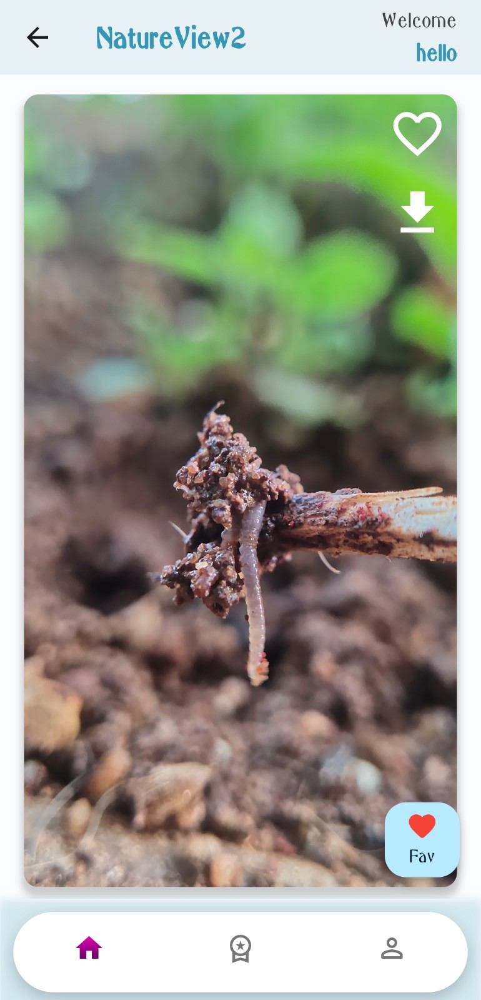

# NatureView2

Welcome to NatureView2 - Your Window to the Beauty of Nature!

## Overview

NatureView2 is a Flutter application that brings you breathtakingly beautiful photographs capturing the essence of nature. Immerse yourself in the tranquility of landscapes, vibrant flora, and mesmerizing scenery. This app not only allows you to view and download these stunning images but also provides a premium experience for subscribers, unlocking access to rare and exclusive photos.

## Features

- **Explore Nature's Beauty:** Browse through a curated collection of high-quality nature photographs.
  
- **Favorites:** Mark your favorite images and create your personalized collection.
  
- **Pro Membership:** Unlock the Pro Membership to access exclusive and rare nature photographs. Subscribe to elevate your viewing experience.
  
- **Video Preview:** Get a sneak peek into the app through an introductory video showcasing its user-friendly interface and a preview of five extraordinary images.

## Screenshots

  
  
  
  
  

## Pro Membership

NatureView2 offers a Pro Membership for enthusiasts seeking a deeper connection with nature through rare and mesmerizing photographs. Subscribe to the Pro Membership for an enhanced experience.

## Download

[**Click to Download APK**](https://drive.google.com/file/d/1Llv1s4fwzJWMAASoiYnrIKEwkpUXaRzA/view?usp=sharing)
